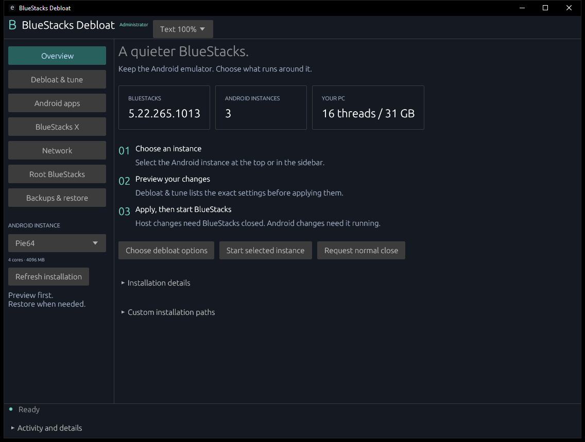

# BlueStacks Debloat

A native Windows app to clean up BlueStacks 5, remove its cloud companions, tune settings, and manage root.

**[Download BluestacksDebloat.exe](https://github.com/Jordan231111/Bluestacks-Debloat/releases/latest/download/BluestacksDebloat.exe)** · [Release notes](https://github.com/Jordan231111/Bluestacks-Debloat/releases/latest)

Windows 10/11 **64-bit**. Download and double-click the executable. No Rust installation or separate runtime is needed.

## What it does

| Feature | What you get |
|---|---|
| **Debloat** | Disable reviewed ads, promotions, telemetry, automatic downloads, and optional Android packages. |
| **Remove BlueStacks X** | Remove X/Store and the separate cloud Services companion while keeping the local emulator and Android data. |
| **Maximum preset** | Select the available debloat and tuning options, including a 240 FPS limit. **CPU cores and RAM stay unchanged.** |
| **Root BlueStacks** | A dedicated Magisk tab with guided installation, repair, verification, unroot, and disk recovery. |
| **Network controls** | Inspect BlueStacks connections, block two BlueStacks advertising domains, and optionally isolate its launcher from the Internet. Google and game domains are excluded. |
| **Backups & restore** | Preview changes, save recovery copies, verify results, and restore recorded changes. |

The interface adapts to smaller windows and Windows display scaling, with adjustable text size.

## Get started

1. **Open the app** and select your BlueStacks instance. Installation folders are detected automatically.
2. **Choose your options** in Debloat & tune, or select Maximum debloat.
3. **Preview, then apply.** Close BlueStacks for host changes and use the app's administrator restart button when required.
4. **Finish Android and Network options** with the selected instance running and ADB enabled in BlueStacks Settings → Advanced. Rooting is a separate action in Root BlueStacks.

Maximum selects options across tabs; apply each stage when prompted. Use **Backups & restore** to undo debloat changes, or the Root tab for disk recovery.

## Before you use it

- Tested on **BlueStacks 5.22.265.1013**, with Android 9, 11, and 13 instances. The complete fresh-root cycle was tested on Android 11. See the [validation record](docs/VALIDATION.md).
- Rooting and binary patching are optional advanced features. Some games reject rooted devices. A higher FPS limit does not guarantee higher performance and can increase power use.
- Launcher isolation also disables its online recommendations, search, and Store features. It requires Magisk root.
- Recovery copies use disk space. Root recovery restores Android data to the saved point in time. This release is unsigned.

## Learn more

[Usage & recovery](docs/RUNBOOK.md) · [Rooting](docs/ROOTING.md) · [Exact changes](docs/WHAT-IT-REMOVES.md) · [CLI](docs/CLI.md) · [Build from source](docs/BUILDING.md)

The existing [CC BY-NC-ND 4.0 license](LICENSE) applies to this project. Bundled root tools retain their [own licenses and source attribution](assets/root/NOTICE.md). Root support derives from [BluestacksRoot](https://github.com/Jordan231111/BluestacksRoot). No proprietary BlueStacks executables or virtual disks are redistributed.
